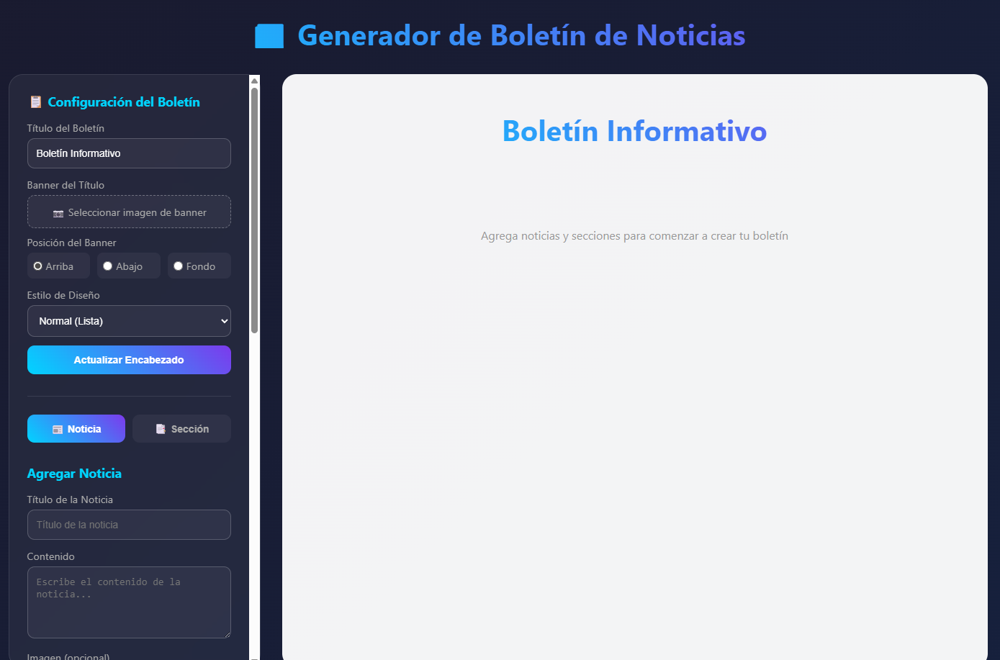
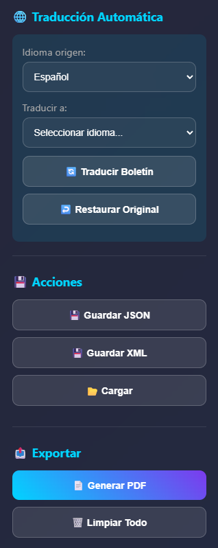

  

# 📰 Newsletter Creator

A lightweight **visual newsletter builder** written in pure **HTML, CSS, and JavaScript**.

Create beautiful newsletters directly in your browser with **drag & drop editing**, **images**, **multiple layouts**, **automatic translation**, and **PDF export** — no installation required.

Perfect for teachers, small organizations, community groups, or anyone looking to create a printable newsletter quickly.

---

## ✨ Features

### 📝 Visual Newsletter Editor
- Add **news items** and **sections**
- Edit titles, content, and images
- Rearrange content using **drag & drop**

### 🎨 Multiple Layout Styles
Choose the layout that best fits your content:

- **Normal Layout** – classic vertical list
- **Column Layout** – 2 or 3 column newspaper style
- **Comic Layout** – panels that can be **resized like comic frames**

### 🖼 Image Support
Add images to:

- Newsletter header
- News items
- Sections

Image positioning options:
- Above content
- Below content
- As background

### 🌍 Automatic Translation
Translate the entire newsletter into multiple languages:

- Spanish
- English
- French
- Portuguese

Uses multiple fallback translation APIs to increase reliability.

### 📄 Export Options
Save and share your work in multiple formats:

- **PDF export** (ready for printing)
- **JSON save/load**
- **XML save/load**

### 💾 Project Persistence
You can save your work and continue later:

- `Save JSON`
- `Save XML`
- `Load saved project.`

---

## 🚀 How to Use

1. Download the project.
2. Open: BoletinCreator.html in any modern browser.

No server required.

Everything runs locally in your browser.

---

## 🖥 Interface Overview

The interface is divided into two main panels:

### Control Panel
Used to:
- Configure newsletter title and banner
- Add news or sections
- Change layout
- Translate the newsletter
- Save / load projects
- Export PDF

### Preview Panel
Displays a **live preview** of your newsletter while editing.

You can:
- Drag elements to reorder them
- Resize panels in comic mode
- Edit or delete elements directly

---

## 🧠 Technical Details

The project is intentionally **framework-free**.

Built with:

- HTML5
- CSS3
- Vanilla JavaScript

External libraries:

- **html2pdf.js** – PDF generation
- **MyMemory / Lingva APIs** – automatic translation

All images are stored as **Base64** so the newsletter remains fully self-contained.

---

## 📦 File Structure

project/
│
├── BoletinCreator.html
└── README.md

The entire application lives inside a **single HTML file**, making it easy to distribute and use offline.

---

## 🎯 Use Cases

This tool is ideal for:

- School newsletters
- Community bulletins
- Church announcements
- Classroom activities
- Small organization communications
- Printable newsletters

---

## ⚠ Limitations

- Designed for **small to medium newsletters**
- Translation APIs may occasionally fail if services are unavailable
- Large images increase file size because they are stored in Base64

---

## 💡 Future Improvements

Possible enhancements:

- Markdown support
- Better image compression
- Custom themes
- Newsletter templates
- Cloud saving
- Multi-page PDF export

---

## 📜 License

Free to use and modify.

---

## 🤖 About the Project

This tool was built as a **small experimental project** exploring what can be achieved with **pure browser technologies without frameworks**.

A single HTML file that becomes a **complete visual editor**.

---

⭐ If you find this useful, consider starring the repository.

## 📸 Screenshots

### Editor Interface

### Layout Styles

### Translation & Export

